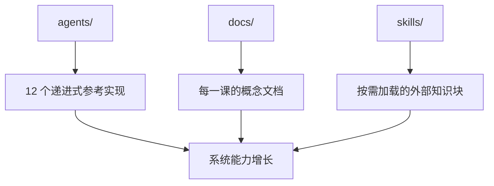
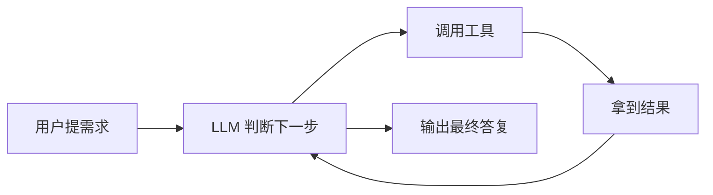
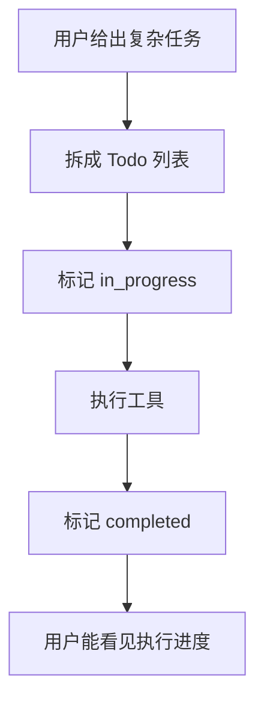
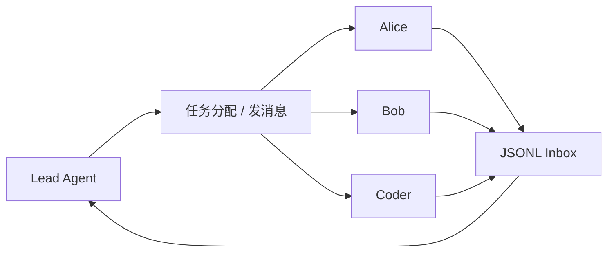
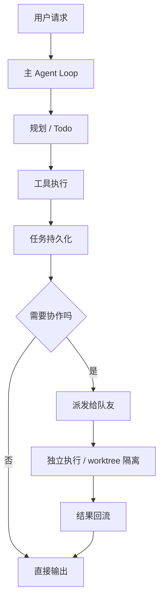

# 仓库全景图：这个教学仓库到底在教什么

## 先说结论

这个仓库表面上是在教你“怎么写一个 Claude Code-like agent”，但如果站在后端工程师转 AI agent 岗位的视角，它真正教的是 3 件事：

1. 如何把大模型从“会说话”变成“会执行”的系统。
2. 如何把一次性对话变成“有状态、有协作、有生命周期”的任务系统。
3. 如何把单个 agent 能力扩展成一个可管理的团队式执行系统。

换句话说，它不是一个单纯的 Python 教程，而是一份极简版的 AI agent 系统设计课程。

---

## 一、这个仓库的本质不是“代码仓库”，而是“能力递进课程”

从目录上看，它有 3 个你需要关心的部分：

对你来说，最重要的是 `agents/`，因为它展示了 agent 系统能力从无到有的演进路径。

## 二、这 12 节课，实际上分成 4 个业务层

### 第 1 层：让模型开始“干活”

对应 `s01-s02`

- `s01` 解决的是“模型怎么从只会回答，变成会调用工具”
- `s02` 解决的是“工具越来越多时，怎么优雅扩展”

这层的业务目标不是复杂，而是建立最小闭环：

这就是所有 agent 的内核。后面的 10 节课，本质上都是在这个环上“加治理能力”。

### 第 2 层：让执行过程有计划、有知识、有记忆

对应 `s03-s06`

- `s03` 引入 Todo，解决“多步任务容易乱”的问题
- `s04` 引入子智能体，解决“探索过程污染主上下文”的问题
- `s05` 引入 Skill，解决“领域知识不能全塞进 system prompt”的问题
- `s06` 引入上下文压缩，解决“会话越来越长，token 撑爆”的问题

这一层关心的是“执行质量”。

### 第 3 层：让状态脱离聊天记录，进入持久化系统

对应 `s07-s08`

- `s07` 把任务写到 `.tasks/`，让状态不再只存在对话里
- `s08` 把慢操作丢到后台，避免主循环阻塞

这一层关心的是“系统可靠性”。

### 第 4 层：让一个 agent 进化成一个组织

对应 `s09-s12`

- `s09` 引入持久化队友和收件箱
- `s10` 引入协议、审批、关机协商
- `s11` 引入自治认领任务
- `s12` 引入 worktree 目录隔离

这一层关心的是“规模化协作”。

---

## 三、站在产品经理角度，这个仓库在解决什么用户问题

你可以把这套系统理解为一个“AI 执行产品”的成长过程。

| 阶段 | 用户抱怨 | 系统补上的能力 | 用户价值 |
|---|---|---|---|
| s01-s02 | 它只会说，不会做 | 工具调用 + dispatch | 能动手执行 |
| s03-s06 | 它会做，但过程乱、记不住 | 计划、子任务、技能、压缩 | 执行更稳定 |
| s07-s08 | 它做着做着就忘了、卡住了 | 磁盘任务、后台线程 | 能持续运行 |
| s09-s12 | 它一个人干不完，还容易互相干扰 | 多 agent、协议、自治、隔离 | 能并行协作 |

这非常像一个 SaaS 产品的功能演进：

1. 先有一个能跑通主链路的 MVP。
2. 再解决可用性和成功率。
3. 再解决状态持久化和性能。
4. 最后解决组织协作和扩展性。

---

## 四、这个仓库里最值得你深挖的点

## 1. `agent_loop` 是整个系统的“交易主链路”

仓库反复强调一件事：循环本身几乎不变，变化的是外围能力。

这对后端工程师很重要，因为你会发现 agent 系统和传统业务系统很像：

- 主循环像请求处理主链路
- 工具像外部依赖或服务调用
- `tool_result` 像下游返回结果
- `stop_reason` 像状态机分支

### 为什么值得挖

因为这会让你在面试里讲出一句非常有水平的话：

> AI agent 不是魔法，它是一个由 LLM 决策驱动的控制循环。真正的工程工作在于把工具、状态、协议和隔离层逐层加进去。

## 2. Todo 不是 UI 装饰，而是执行控制器

`s03` 的核心不是列清单，而是把“内部思考状态”转成“外部可观测状态”。

这有两层价值：

- 对模型：减少多步任务跑偏
- 对人类：让用户看到 agent 当前做到哪里

这背后是典型产品思想：

如果你转岗做 AI agent，Todo、Plan、Task 这些并不是“附加功能”，而是核心交互资产。

## 3. 子智能体和上下文压缩，本质上是在做资源治理

很多人第一次看 agent，会把重点放在“智能”上；但真正做系统时，重点很快会转到“资源”上：

- 上下文窗口有限
- 工具返回可能很长
- 探索任务会污染主任务
- 聊天越久，成本越高

所以 `s04-s06` 的价值非常大。它教的是：

- 子任务要隔离上下文
- 知识要按需注入
- 历史要有压缩策略

这和后端的缓存、分页、异步化、冷热分层本质相通。

## 4. `.tasks/` 目录是从“对话系统”走向“工作流系统”的分水岭

`s07` 是全仓库最重要的分水岭之一。

在 `s07` 之前，很多状态都只在 `messages[]` 里；在 `s07` 之后，任务进入磁盘文件，开始具备：

- 可恢复
- 可查看
- 可依赖编排
- 可被多个 agent 共享

这里最值得你理解的一点是：

> 只存在于上下文里的状态，不是真正可靠的系统状态。

这句话对 AI agent 岗位非常关键。

## 5. `s09-s11` 其实是在讲“组织设计”

这几节课看起来像“多线程 + 收件箱 + 自动认领任务”，但从产品和业务角度，它们是在构造一个最小组织：

- 有角色
- 有身份
- 有通信渠道
- 有审批流程
- 有空闲时的自动找活机制

这已经不是单个 agent 了，而是在做数字劳动力组织。

## 6. `s12` 的控制平面 / 执行平面分离，最接近生产系统

`s12` 教的不是“Git 小技巧”，而是一个很关键的系统设计思想：

- 任务系统负责协调与调度
- worktree 负责提供物理隔离的执行环境

这就像：

- Kubernetes 里的控制器和 Pod
- CI 系统里的任务记录和独立 runner
- 工单系统里的 ticket 和具体执行容器

它解决的是“并行执行互相污染”的根问题。

---

## 五、如果你完全不懂 Python，应该怎么读这个仓库

建议你不要从语法入手，而是从“角色”和“状态流转”入手。

### 先看角色

- 用户
- 主 agent
- 子 agent
- teammate
- task manager
- message bus
- background manager
- worktree manager

### 再看状态

- 当前消息上下文 `messages[]`
- Todo 列表
- 任务文件 `.tasks/*.json`
- 团队配置 `.team/config.json`
- 收件箱 `.team/inbox/*.jsonl`
- worktree 索引 `.worktrees/index.json`

### 最后看流转

这样读，你读到的是业务机制，而不是 Python 细节。

---

## 六、你可以把这个仓库包装成怎样的项目经验

如果你未来去面试 AI agent 岗位，可以这样表述：

> 我系统拆解过一个从单 agent 到多 agent 的教学仓库，重点理解了工具调用循环、计划管理、上下文治理、任务持久化、异步执行、多 agent 协作协议，以及基于 worktree 的隔离执行设计。我能从后端系统设计角度解释它为什么这样设计，以及哪些部分是教学简化、哪些部分可迁移到生产系统。

这比“我看过一些 agent 代码”强很多。

---

## 七、读完这一篇后你要记住的 3 句话

1. 这个仓库教的不是 Python，而是 AI agent 的系统演进路线。
2. 真正值得挖的，不是某个函数怎么写，而是状态、协议、协作、隔离怎么逐层建立。
3. 你作为后端开发者的优势，恰好就在这些地方。
