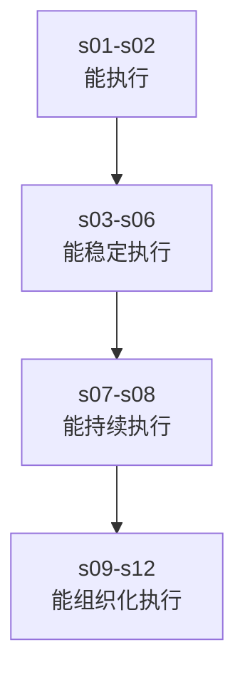
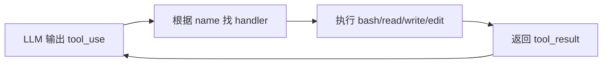
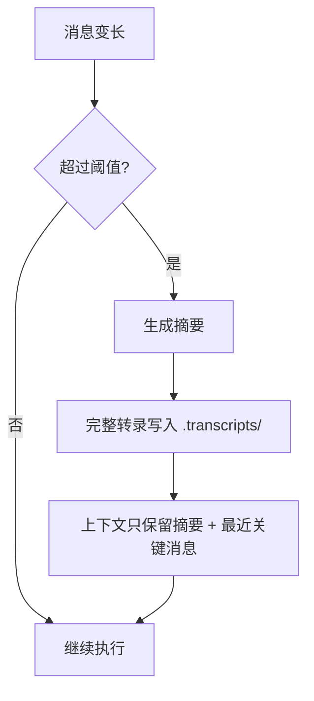
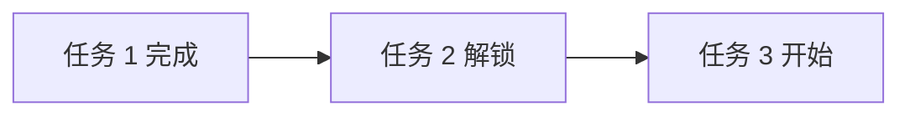
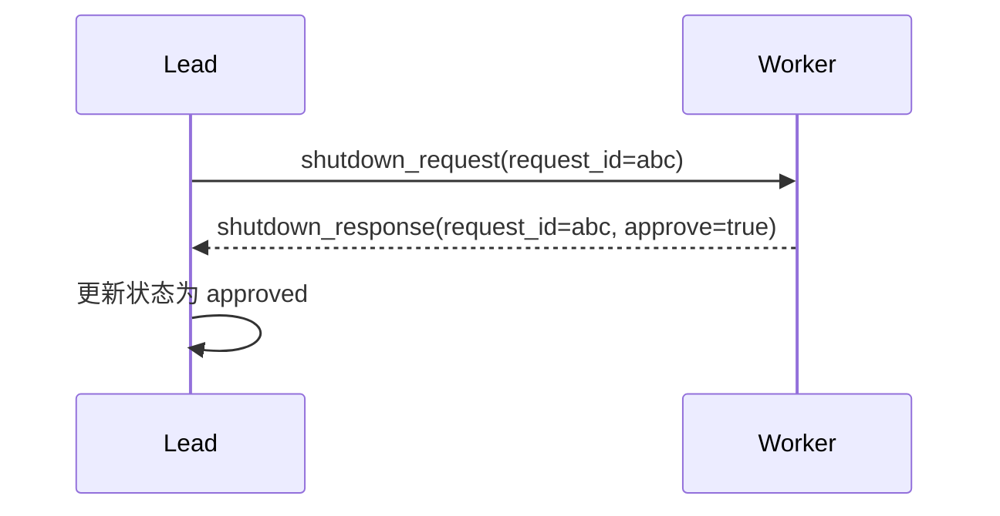
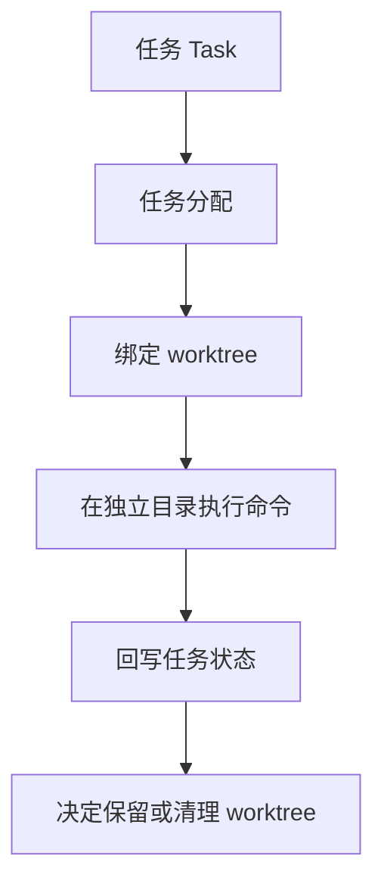

# 12 节课的业务递进图：一个 agent 系统是怎样长出来的

## 先建立总图

这 12 节课不是 12 个零散功能，而是同一个系统的 12 次扩容。

把它翻译成产品语言就是：

- 第一阶段：先做出一个会动手的 MVP
- 第二阶段：提高成功率和可控性
- 第三阶段：提高持久性和吞吐
- 第四阶段：提高协作规模和隔离能力

---

## 一、阶段一：从“回答问题”到“真正执行”

### s01 Agent Loop

#### 解决的问题

模型会推理，但它碰不到文件系统、命令行和真实运行环境。

#### 新增机制

- 消息数组 `messages[]`
- LLM 调用
- `tool_use` 判断
- 工具结果回注

#### 业务意义

这是 agent 的交易主链路。没有它，就没有后续所有能力。

#### 你应该怎么理解

这和后端里的“请求进来 -> 调服务 -> 处理结果 -> 决定下一步”完全同构。

### s02 Tool Use

#### 解决的问题

只有一个工具不够用，新增能力时不能每次重写主循环。

#### 新增机制

- 工具列表
- `name -> handler` 的 dispatch map

#### 业务意义

系统开始具备“插件化”能力，后面所有新工具都能按这个模式挂进来。

#### 一眼看懂图

---

## 二、阶段二：从“能执行”到“执行过程可控”

### s03 TodoWrite

#### 解决的问题

多步任务没有显式计划，模型容易跳步、漏步、重复做。

#### 新增机制

- `TodoManager`
- 任务状态 `pending / in_progress / completed`
- nag 提醒

#### 产品价值

- 用户第一次能看到 agent 的进度
- 执行从黑箱变成半透明

#### 对你的启发

Todo 其实就是最小版工作流引擎。

### s04 Subagent

#### 解决的问题

主上下文里塞太多探索内容，会让主任务越来越乱。

#### 新增机制

- 子智能体有自己的 `messages[]`
- 子智能体共享文件系统
- 子智能体只返回摘要

#### 产品价值

- 主对话更干净
- 大任务更容易分解

#### 关键认知

这不是“多开一个函数”，而是在做上下文隔离。

### s05 Skill Loading

#### 解决的问题

领域知识全塞 system prompt 会导致：

- prompt 太重
- token 浪费
- 不相关知识污染当前任务

#### 新增机制

- 扫描 `skills/*/SKILL.md`
- system prompt 中只放简介
- 真正需要时再 `load_skill`

#### 产品价值

- 更轻
- 更准
- 更可扩展

#### 你可以怎么理解

这像“按需加载配置”或“懒加载知识模块”。

### s06 Context Compact

#### 解决的问题

对话一长，模型上下文会爆。

#### 新增机制

- 微压缩：旧 `tool_result` 替换为占位
- 自动压缩：达到阈值后摘要化
- 手动压缩：模型主动触发 compact

#### 产品价值

- 会话更长
- 成本更可控
- 历史更有层次

#### 核心图

---

## 三、阶段三：从“对话机器人”到“工作流系统”

### s07 Task System

#### 解决的问题

如果任务只存在于聊天记录里：

- 一压缩就丢
- 一换人就断
- 一协作就乱

#### 新增机制

- `.tasks/task_x.json`
- 任务 CRUD
- `blockedBy` / `blocks` 依赖关系

#### 产品价值

- 任务可恢复
- 任务可并行拆分
- 任务不再依赖单个会话存活

#### 业务图

#### 这是你最应该学的一课之一

因为这节课标志着系统开始从“智能对话”升级成“任务编排”。

### s08 Background Tasks

#### 解决的问题

长时间命令会阻塞主循环，agent 会卡在原地。

#### 新增机制

- 后台线程执行
- 通知队列
- 主循环定期 drain 通知

#### 产品价值

- 用户等待时间降低
- 多个慢任务可以并发跑
- agent 可以边等边做别的事

#### 你熟悉的类比

这就是异步任务队列的极简版。

---

## 四、阶段四：从“单人作战”到“团队作战”

### s09 Agent Teams

#### 解决的问题

子智能体虽然能拆任务，但做完就消失，没有身份、没有持续协作关系。

#### 新增机制

- 队友名册
- 每个队友独立线程
- `.team/inbox/*.jsonl` 邮箱

#### 产品价值

- 可持续分工
- 可跨轮通信
- 可角色化协作

### s10 Team Protocols

#### 解决的问题

队友之间如果只有自由文本消息，涉及审批、关机、计划确认时会失控。

#### 新增机制

- `request_id`
- `shutdown_request / shutdown_response`
- `plan_approval_response`
- `pending -> approved/rejected` 状态机

#### 产品价值

- 协作有规矩
- 状态可追踪
- 便于审计

#### 一眼看懂图

### s11 Autonomous Agents

#### 解决的问题

如果所有任务都靠主 agent 显式分配，系统吞吐很快会受限。

#### 新增机制

- idle 状态
- 周期轮询
- 自动认领未分配任务

#### 产品价值

- 减少主 agent 调度压力
- 队友可以自己找活干
- 系统更像真实组织

### s12 Worktree Task Isolation

#### 解决的问题

多人并行改同一仓库，很容易互相覆盖、冲突、污染环境。

#### 新增机制

- 任务绑定 worktree
- `.worktrees/index.json`
- 生命周期事件
- 独立目录执行

#### 产品价值

- 并行开发更安全
- 每个任务有独立执行车道
- 控制信息和执行环境分离

#### 最关键的一张图

---

## 五、把 12 节课浓缩成一张总表

| 课程 | 解决的核心问题 | 新机制 | 后端熟悉类比 |
|---|---|---|---|
| s01 | 模型怎么真正干活 | 主循环 | 请求处理循环 |
| s02 | 工具怎么扩展 | dispatch map | 路由分发 |
| s03 | 多步任务怎么不乱 | TodoManager | 工作流节点 |
| s04 | 大任务怎么隔离 | subagent | 子任务上下文 |
| s05 | 知识怎么按需加载 | SkillLoader | 懒加载配置 |
| s06 | 上下文怎么控成本 | compact | 分层存储 / 摘要 |
| s07 | 状态怎么持久化 | TaskManager | 工单系统 |
| s08 | 慢操作怎么不阻塞 | BackgroundManager | 异步任务 |
| s09 | 多人怎么协作 | MessageBus + Teammate | 服务间消息 |
| s10 | 协作怎么规范 | request_id + FSM | 协议编排 |
| s11 | 怎么自组织 | auto-claim | 拉模式调度 |
| s12 | 并行怎么隔离 | WorktreeManager | 独立 runner |

---

## 六、你应该优先深挖哪几节

如果你的目标是“转岗 AI agent 岗位”，优先顺序我建议这样排：

1. `s01-s02`
原因：理解 agent 最小闭环和能力扩展边界。

2. `s07`
原因：理解为什么任务必须从对话里外置出来。

3. `s09-s12`
原因：这部分最像生产系统，也最能体现你的后端优势。

4. `s03-s06`
原因：这是影响成功率、成本和可控性的关键治理层。

---

## 七、产品经理会怎么教你看这 12 节课

如果我以产品经理视角对你说一句话，那就是：

> 不要把这 12 节课看成 12 个技术点，要把它看成一个 AI 产品从 MVP 到组织化执行平台的成长路线。

看懂这一点，你就不是在学 Python 代码，而是在学 AI agent 产品怎么设计。
