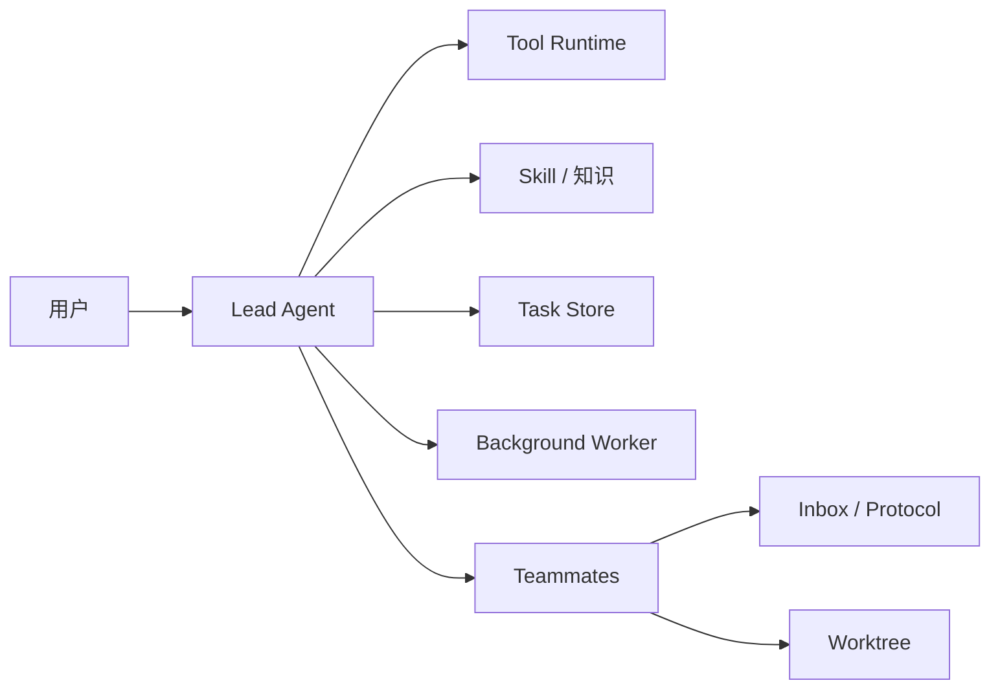
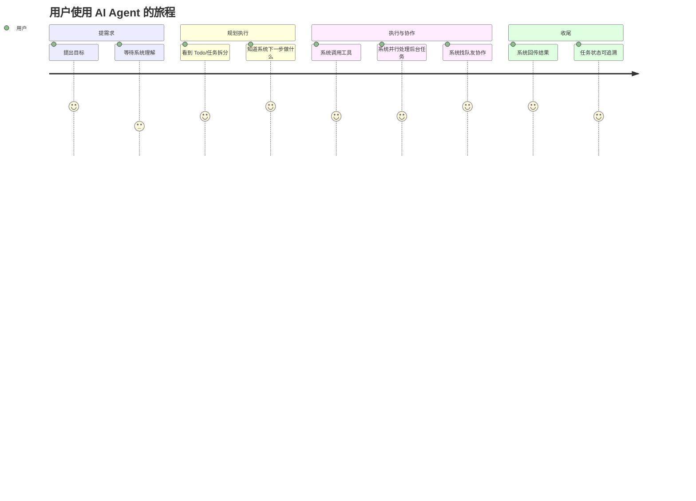

# 产品经理视角：如果把这个仓库当成一个 AI 产品，业务逻辑是什么

## 一、先给这个产品下定义

从产品角度看，这个仓库可以被理解成一个“教学型 AI 执行代理产品”的拆解样板。

它的目标不是单纯回答用户，而是完成一个完整的价值闭环：

1. 理解用户意图
2. 制定执行计划
3. 调用外部能力
4. 持续更新状态
5. 必要时协作和审批
6. 在隔离环境里完成任务
7. 回传结果

## 二、产品里的核心角色

### 角色解释

#### 用户

提出目标，不负责底层执行细节。

#### Lead Agent

像一个项目经理兼调度中枢，负责：

- 理解任务
- 分解计划
- 决定调用什么工具
- 决定是否需要队友

#### Tool Runtime

是真正碰到现实世界的执行层，比如读文件、写文件、跑 bash。

#### Task Store

保存系统“当前到底在干什么”，是业务事实来源。

#### Teammates

承担分工执行，是扩展吞吐和专业分工的方式。

#### Inbox / Protocol

相当于组织内部的通信规范。

#### Worktree

相当于物理隔离的执行工位。

---

## 三、这个产品的用户旅程是什么

把仓库里的逻辑翻译成用户旅程，大概是这样：

这个旅程里，用户最在意的不是“模型用了什么 prompt”，而是：

- 它有没有真的在推进任务
- 它现在做到哪一步
- 卡住时谁来接管
- 多任务时会不会互相冲突

这就是为什么这个仓库大量篇幅都在讲任务、状态、协作和隔离。

---

## 四、如果你是产品经理，如何拆这套系统的 PRD

我会把它拆成 6 个产品模块。

### 模块 1：执行引擎

#### 用户问题

“它只会回答，不会真正执行。”

#### 对应实现

- `s01` agent loop
- `s02` 工具分发

#### 产品目标

让 AI 具备基础行动能力。

### 模块 2：执行可视化与稳定性

#### 用户问题

“它到底在做什么？为什么有时会乱？”

#### 对应实现

- `s03` Todo
- `s04` Subagent
- `s05` Skills
- `s06` Compact

#### 产品目标

让执行更稳、更清晰、更可控。

### 模块 3：任务资产化

#### 用户问题

“任务不能只存在聊天里，不然一断就没了。”

#### 对应实现

- `s07` Task System

#### 产品目标

让任务成为独立资产，而不是会话附属物。

### 模块 4：异步与吞吐

#### 用户问题

“长时间操作会拖死整个交互。”

#### 对应实现

- `s08` Background Tasks

#### 产品目标

让系统具备同时处理多个执行单元的能力。

### 模块 5：组织协作

#### 用户问题

“一个 agent 干不完复杂任务，而且需要明确角色边界。”

#### 对应实现

- `s09` Teams
- `s10` Protocols
- `s11` Autonomous Agents

#### 产品目标

让系统从单智能体进化为协作组织。

### 模块 6：隔离执行

#### 用户问题

“并行任务会互相污染，尤其是代码改动类场景。”

#### 对应实现

- `s12` Worktree Isolation

#### 产品目标

让多个执行单元在独立环境中并行推进。

---

## 五、从产品价值看，最关键的 5 条业务逻辑

## 1. 用户不是在买“一个模型”，而是在买“一个能完成任务的流程”

用户给出的是目标，不是提示词竞赛题。

所以系统必须负责：

- 理解目标
- 把目标转成可执行步骤
- 调用工具
- 汇报状态
- 必要时重试、拆分、协作

这意味着 AI agent 产品的核心竞争力，往往不是单轮回答质量，而是任务完成率。

## 2. 可观测性就是产品体验

很多工程师会把 Todo、任务列表、状态变化视为“内部实现细节”。

但从产品角度看，这些东西直接决定用户是否相信系统。

用户为什么会焦虑？

- 不知道系统是不是卡住了
- 不知道系统下一步要干什么
- 不知道失败发生在哪

而 `TodoManager`、`TaskManager`、`request_id`、事件流，本质上都在解决信任问题。

## 3. 技能加载不是技术炫技，而是知识产品化

`skills/` 目录非常值得你留意，因为它代表一种重要产品思想：

> 让知识模块化、可复用、可按需注入。

这意味着未来的 agent 产品可以把行业知识包装成：

- 财务 skill
- 法务 skill
- 代码评审 skill
- PDF 处理 skill

这种设计对商业化很重要，因为它把“能力”和“知识”拆成两种可管理资产。

## 4. 多 agent 不是噱头，前提是有协议和状态

很多 AI 产品喜欢讲“多 agent 协同”，但没有协议时，多 agent 往往只是多几个会聊天的进程。

这个仓库比较好的地方在于它明确教了你：

- 没有 `request_id`，就无法关联请求与响应
- 没有收件箱，消息就无法持久化
- 没有状态机，审批流就没有边界

所以真正的多 agent，本质上是组织协作系统，而不是多开几个模型。

## 5. 隔离执行是做代码类 agent 的底线

只要任务涉及：

- 改代码
- 跑测试
- 生成文件
- 并行试验

隔离执行就不是锦上添花，而是底线。

`s12` 正是在教这一点。

---

## 六、如果你是产品经理，会怎么评估这个系统是否做好

我会关心 4 类指标。

### 任务成功率

- 用户目标是否被真正完成
- 多步任务是否中途跑偏

### 执行透明度

- 用户是否能看到任务进度
- 是否知道当前卡在哪

### 协作效率

- 队友认领任务是否顺畅
- 消息传递是否稳定
- 审批流是否可跟踪

### 隔离安全性

- 并行任务是否互相污染
- worktree 生命周期是否可控

---

## 七、如果我是你的产品经理，我会怎么教你理解这个仓库

我会这样对你说：

### 第一句

不要问“这个函数在干嘛”，先问“这个机制解决了用户的什么问题”。

### 第二句

不要把大模型当成唯一核心，真正能交付业务价值的是围绕大模型的状态系统、工具系统和协作系统。

### 第三句

后端工程师在 AI agent 岗位最有竞争力的地方，不是写 prompt，而是把 agent 变成一个可靠的系统。

---

## 八、这篇文档的最终结论

这个仓库值得挖掘，不是因为它“教了 12 个 Python demo”，而是因为它用极少的代码，把 AI agent 产品最重要的业务逻辑都摆出来了：

- 如何执行
- 如何规划
- 如何记忆
- 如何持久化
- 如何异步
- 如何协作
- 如何审批
- 如何自治
- 如何隔离

这些内容，正好和一个后端开发者转 AI agent 岗位时最该建立的能力图谱重合。
